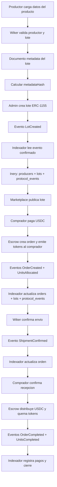

# Indexacion hacia Inery

## Objetivo

Construir una vista contable y operativa consultable sin usar Inery como fuente
de verdad para pagos o stock. Arbitrum y los contratos son la fuente de verdad
del estado on-chain. Inery conserva una representacion humana, historica y
consultable de ese estado.

El indexador debe escuchar eventos confirmados de los contratos, normalizarlos y
escribir registros idempotentes. Un mismo evento nunca debe crear dos registros.

La documentacion oficial actual de Inery expone una API DLS `2.0.0`, incluyendo
Database API, Transaction API y permisos por cuenta. La implementacion concreta
del escritor debe probarse primero contra un entorno de desarrollo de Inery.

## Flujo general



## Regla de tokens

Al crear el lote no se emite todo el supply:

```text
tokenId: 1001
maxSupply: 1000
reservedSupply: 0
soldSupply: 0
retiredSupply: 0
balance productor: 0
balance compradores: 0
```

Si un comprador adquiere `10` unidades:

```text
reservedSupply: 10
soldSupply: 0
retiredSupply: 0
availableSupply: 990
balance comprador durante la orden: 10
```

Al completar o reembolsar la orden, esos `10` tokens se queman:

- venta completada: la reserva pasa a `soldSupply`;
- reembolso con producto recuperado: la reserva vuelve a estar disponible;
- reembolso sin producto recuperado: la reserva pasa a `retiredSupply`.

## Documento de metadata y hash

El `metadataHash` on-chain no debe calcularse sobre el registro mutable de
`lots`. Debe calcularse solamente sobre un documento de metadata estable como
`examples/inery/lot-1001-metadata.json`.

Proceso recomendado:

```text
metadata JSON
  -> canonicalizar JSON con RFC 8785
  -> calcular keccak256 de los bytes UTF-8
  -> enviar hash al crear el lote
  -> guardar documento y hash en Inery
```

Los cambios de stock, precio o estado no invalidan la descripcion original. Si
cambia la descripcion, se crea una nueva version de metadata y se registra su
nuevo hash mediante `LotMetadataUpdated`.

## Colecciones recomendadas

### `producers`

| Campo | Descripcion |
| --- | --- |
| `producerId` | Wallet del productor en minusculas |
| `displayName` | Nombre publico |
| `profileHash` | Hash registrado en `ProducerRegistry` |
| `status` | Estado normalizado del productor |
| `shipmentFailureCount` | Incumplimientos confirmados |
| `feeBps` | Tarifa vigente en puntos base |
| `updatedFromEventId` | Ultimo evento aplicado |

### `lots`

| Campo | Descripcion |
| --- | --- |
| `lotId` | `tokenId` ERC-1155 |
| `chainId` | Red donde vive el contrato |
| `contractAddress` | Direccion de `RuralProducts1155` |
| `producerWallet` | Productor asociado |
| `productName` | Nombre humano del producto |
| `unitDescription` | Significado de una unidad/token |
| `maxSupply` | Stock inicial historico |
| `reservedSupply` | Stock dentro de ordenes abiertas |
| `soldSupply` | Stock vendido definitivamente |
| `retiredSupply` | Stock retirado y no disponible |
| `availableSupply` | `maxSupply - reservedSupply - soldSupply - retiredSupply` |
| `unitPrice` | Precio en unidad minima de USDC |
| `paymentToken` | Direccion del token de pago |
| `metadataHash` | Hash anclado on-chain |
| `active` | Disponibilidad para nuevas compras |
| `createdTxHash` | Transaccion que creo el lote |

### `orders`

| Campo | Descripcion |
| --- | --- |
| `orderId` | Identificador del escrow |
| `lotId` | Lote comprado |
| `buyerWallet` | Wallet compradora |
| `producerWallet` | Wallet productora |
| `quantity` | Tokens/unidades compradas |
| `grossAmount` | USDC depositado |
| `status` | Estado actual normalizado |
| `agreementHash` | Hash del acuerdo de la operacion |
| `shippingEvidenceHash` | Hash de evidencia de envio |
| `disputeEvidenceHash` | Hash de evidencia de disputa |
| `disputeOpenedBy` | Wallet del comprador o administrador que congelo la orden |
| `shipmentFailureRecorded` | Indica falta objetiva por no envio dentro del plazo |
| `stockRestored` | Indica si el producto fisico fue recuperado tras reembolso |
| `resolutionHash` | Hash de resolucion |
| `returnShippingEvidenceHash` | Hash del envio de devolucion |
| `returnReceiptEvidenceHash` | Hash de recepcion y revision del producto devuelto |
| `returnApprovedAt` | Inicio del plazo de 7 dias para despachar devolucion |

### `payments`

Registra de forma separada los importes liberados al productor, tesoreria o
comprador. La clave debe incluir `chainId`, `txHash` y `logIndex`.

### `protocol_events`

Registro append-only de cada log procesado. Es la pista de auditoria y permite
reconstruir las vistas derivadas.

Clave unica recomendada:

```text
eventId = chainId + ":" + transactionHash + ":" + logIndex
```

Campos minimos:

```text
eventId, chainId, blockNumber, blockHash, transactionHash, logIndex,
contractAddress, eventName, decodedArguments, observedAt, confirmationStatus
```

Para disputas debe indexarse especialmente `DisputeOpened`, que identifica quien
congelo la orden. `ProducerFaultRecorded` solamente aparece en reembolsos por no
envio dentro del plazo.

Para devoluciones deben indexarse `ReturnApproved`,
`ReturnShipmentConfirmed` y `ReturnReceived`. Los documentos humanos y datos de
seguimiento permanecen protegidos; on-chain se conservan sus hashes.

El indexador tambien consulta `requiresLogisticsReview(orderId)` para crear
alertas despues de 21 dias, sin interpretar esa alerta como una resolucion.

## Privacidad

No deben guardarse publicamente nombres legales completos, domicilios, telefonos,
correos, codigos de seguimiento ni documentos. Para esos datos se guarda:

- contenido cifrado con acceso controlado; o
- documento privado externo y su hash verificable.

## Confirmaciones y reorganizaciones

El indexador no debe marcar un evento como definitivo apenas aparece. Debe
esperar la cantidad de confirmaciones definida para la red y poder revertir
registros derivados ante una reorganizacion.

## Limite de integracion

Esta especificacion define el formato independiente del proveedor. Antes de
implementar el escritor de Inery se deben confirmar sus APIs, autenticacion,
modelo de permisos, limites y garantias actuales con documentacion oficial.

Referencias oficiales:

- <https://docs.inery.io/>
- <https://docs.inery.io/api/>
- <https://docs.inery.io/api/get-database-info/>
